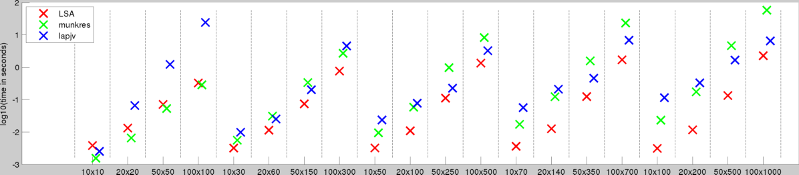

# hungarian
Hungarian algorithm implementation for linear sum assignment problem. Works for square and rectangular cost matrices.

The speed of this implementation (referred to as LSA) is compared to two other ones: 

* [munkres](https://www.mathworks.com/matlabcentral/fileexchange/20652-hungarian-algorithm-for-linear-assignment-problems--v2-3-)
* [lapjv](https://www.mathworks.com/matlabcentral/fileexchange/26836-lapjv-jonker-volgenant-algorithm-for-linear-assignment-problem-v3-0)

For the problems tested, the LSA implementation is consistently much faster for rectangular problems when the cost matrix is M-by-N (M&lt;N).

### Experiment 1 

M-by-N cost matrix obtained as the Euclidean distance between two sets of random points in (2D) plane: 
* ```u = rand(2, M);```
* ```v = .1*rand(2, N) + .5```



### Experiment 2

M-by-N cost matrix is simply obtained as: ```rand(M, N)```.


